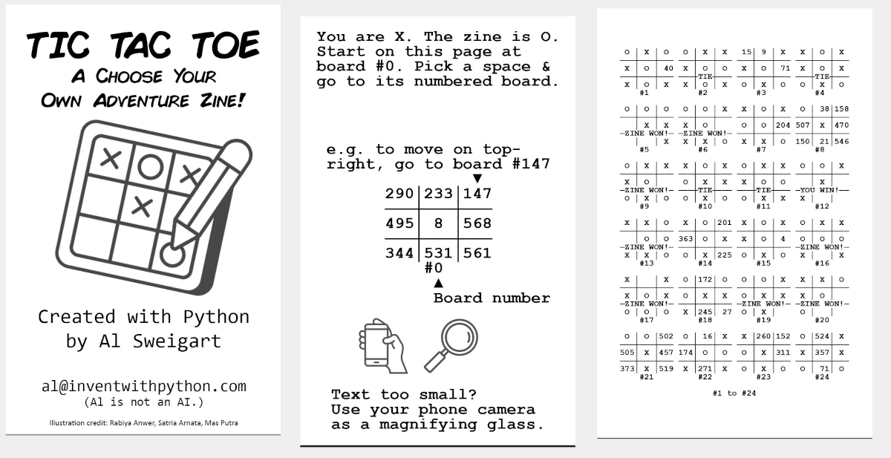
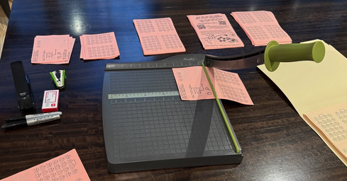
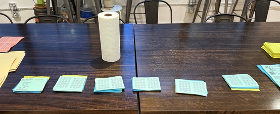
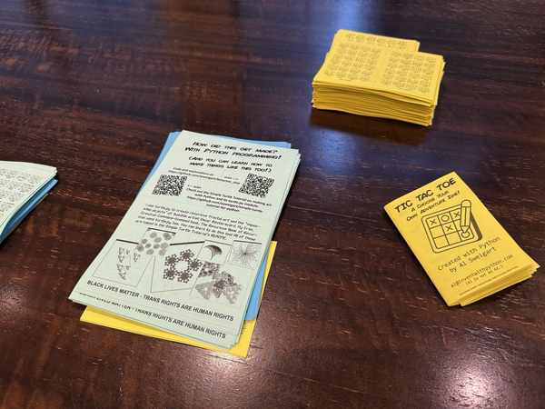
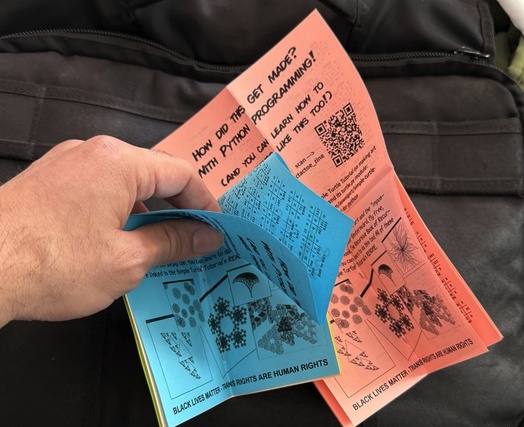
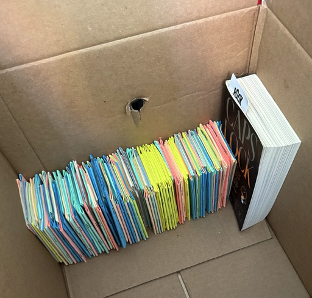

# tictactoe_zine
Code that generates a Choose Your Own Adventure tic tac toe game to be printed as a zine. This is a silly project.

If you want to print out a zine, print TODO

# This is a silly project.

Tic tac toe is a simple game. Making a tic tac toe program isn't an advanced coding task. But I wanted to create a physical object that demonstrated the vast-but-mundane amount of calculation computers do. Creating this zine with pen and paper would take months of effort. But a few hours of coding (and a few more days of tinkering and layout adjustment to appease my perfectionism) can produce a PDF that turns my home laser printer, paper cutter, and stapler into a cottage print shop.

And I can share the PDF on the internet with people around the world for free, along with the program that produced it. It's an interesting thing that people can hold in their hands, and it might strike the curiosity of some of those people to learn how to code.

This is why I love programming; it enables us to follow up on our silly little creative impulses and share our creations with the world.

# Making the Zine from the PDF

To view the zine on your computer or phone, download [tictactoe_zine_linear.pdf](tictactoe_zine_linear.pdf).

To print out and make a physical zine, print [tictactoe_zine.pdf](tictactoe_zine.pdf) on US letter sized paper in portrait orientation, duplexed on the long end (the long end is default).

Cut the first page into four quarters, with two side-by-side pages still attached. Cut the second page into three parts: two quarters and one half-sized page for the centerfold. Be sure to not cut the centerfold image.

Do not use the gray lines as cutting lines; it's easy for printer margin settings to set these off center. Measure the pages (it helps to use a paper cutter) before cutting them.

Fold the half-page centerfold downwards in half, with the tic tac toe boards on the outside. Place the pages on top of each other, with the centerfold on the very top. Fold the pages over to form the booklet shape. Make sure that the tic tac toe tables are in the correct order as you turn the pages.

Use a marker or other flat toolk to put hard creases into the zine after doing the initial fold.

To staple: Flip the booklet over so that the front and back cover are face up. Leave the center fold unfolded so it doesn't get stapled down. Put two staples along the spine. You want the flat part of the staple on the outside and the curled in parts of the staple on the inside.

Since the pages are 1/8 sized of US letter, a regular stapler will work. If you make zines that are quarter- or half-page sized, you'll want to get a stapler with a rotatable head (available online for $10). You don't need to get a bulky, expensive long-arm stapler or saddleback stapler.

If you want to make multiple copies, I recommend:

* Using a paper cutter to cut multiple pages at once.
* Layout the cut pages in order, stacked together by page.
* Fold down all the centerfold pages.
* Assemble the zines.
* Fold the zines.
* Staple the zines.
* Press the zines so they stay folded.

Have regular quality assurance checks throughout this process. Measure twice before doing the cutting and stapling.

# The Code

The make_ttt_zine.py Python script generates the tictactoe_zine.pdf file. You'll need the .png image files (from this repo) in the same folder as the Python script so they can be included in the PDF:

* zine_backcover.png
* zine_frontcover.png
* zine_centerfold.png
* zine_magnifyingglass.png
* zine_smartphone.png

The Python script requires the [Pillow](https://pypi.org/project/pillow/) and [PyPDF](https://pypi.org/project/pypdf/) packages to be installed.

# Links to Other Silly Projects of Mine

* https://github.com/asweigart/my_first_tic_tac_toe
* https://github.com/asweigart/simple-turtle-tutorial-for-python
* https://github.com/asweigart/tortuga
* https://github.com/asweigart/oscarsturtle
* https://github.com/asweigart/turtlesc
* https://github.com/asweigart/art-of-turtle-programming
* https://github.com/asweigart/fractalartmaker

